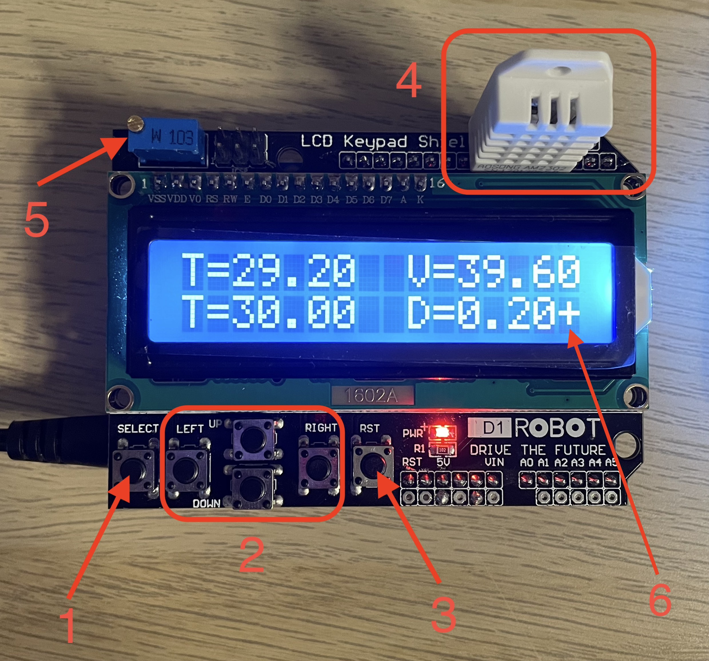

# Контроллер отапления v2.0

## Назначение
Данный контроллер предназначен для реегулирования климата в доме с установленным автоматическим котлом. Регулировка температуры осуществляется включением/отключением циркуляционного насоса отопления по заданным температурам.

⚠️Использвание на котлах без автоматики запрещено, возможен разрыв котла

## Используемые комплненты:
1. Arduino uno
2. LCD keypad shield
3. Датчик температуры DHT22/DHT11
4. Однокатанльно электромагитное реле
5. блок питания 5 вольт

## Органы управления

1. Кнопка для переходя в настройки
2. Кнопки навигации
3. Кнопка перезагрузки
4. Датчик температуры
5. Регулировка контраста
6. Знак работы насоса (+ работает, - не работает)

## Принцип работы
В верхней части дисплея отображается текущая температура и влажность в помещении.
В нижней части дисплея отображается целевая температура и дельта, а так же символ работы насоса
На контроллере устанавливается целевая температура и дельта. При достижении целевой температуры подается сигнал на реле для отключения насоса. При снижении температуры до значения (целевая температура - дельта) подается сигнал для включения насоса.
Насос включается при отсутствии управляющего сигнала с контроллера
Температура считывается с датчика температуры каждую секунду.
Подсветка дисплея отключается при отсутствии нажатий на кнопки управления через 10 секунд. Для включения подсветки можно нажать любую кнопку, кроме кнопки 4 (Перезагрузка)

### Настройка
1. Для установки необходимо нажать кнопку 1 (select)
2. Активная натройка будет мигать
3. Для увеличения/уменьшения значения необходимо нажать кнопку вверх/вниз (2)
4. Для перехода к следующей настроки необходимо нажать кнопку вправо/влево (2)
5. Для сохранения настоек и возврат в основной режим необходимо нажать на кнопку 1 (select)